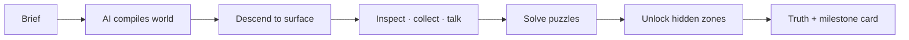

# MYTHRA — forge any story into a playable world

[](https://github.com/xtharshh/apexus-trending)

-c1553b?style=for-the-badge)

-red?style=for-the-badge)

> **MYTHRA** is a proprietary 3D mystery-game engine by **HARSH KUMAR**.
> Type a story brief — walk it as a living world: realistic hardware, correct
> per-object animations, voice narration, multiplayer explorers, checkpoints,
> leaderboards, and milestone brag cards.

<details>
<summary><b>✨ What it does (click to expand)</b></summary>

| Pillar | Feel |
|---|---|
| 🌍 **Any story in** | Mars, ocean, forest, fantasy, horror — the engine dresses every object for its genre |
| 🤖 **Any AI director** | OpenAI · Anthropic · Gemini · OpenRouter · Groq · Mistral · Ollama · custom — or keyless Mock |
| 🧍 **Many solvers, one tale** | Live explorers in scenario suits, name tags, per-tale leaderboard |
| 🎙️ **Voice everywhere** | TTS narration, mic commands, record-your-own story clips, audio self-test |
| 💾 **Never lose a run** | Per-explorer saves + named checkpoints (manual + auto) |
| 🏆 **Show off** | 100% completion mints a shareable milestone card (X / WhatsApp / Telegram / …) |

</details>

<details>
<summary><b>🗺️ How a run plays</b></summary>



Enter → clue → resource → puzzle → mission → hidden location → secret ending.

</details>

<details>
<summary><b>🚀 Run it</b></summary>

```bash
cd mythra
npm install
npm run dev        # game  → http://localhost:5173
npm run dev:api    # API   → http://localhost:4000  (optional; game plays offline without it)
npm test           # 60+ vitest suites, all green
npm run build      # production build
```

Set `VITE_API_URL=http://localhost:4000` to light up multiplayer presence,
the shared leaderboard, and cloud saves. No key, no account needed to play.

</details>

<details>
<summary><b>🎮 Controls</b></summary>

Move **WASD**, look with mouse, **E** interact, **Space** jump, **F** flight suit
(with suit), **Shift** sprint — and every action remaps to your own keys in the
in-game **Control deck** (strict browser keys can never be captured).

</details>

---

### ⚖️ License — proprietary, all rights reserved

MYTHRA is **NOT open source**. See [`LICENSE`](./LICENSE): no use, copying,
distribution, or derivatives — and no ownership claims — without HARSH KUMAR's
written permission. Playing the hosted game is allowed; everything else needs
a yes in writing. 🎮 Build worlds. Give credit.
