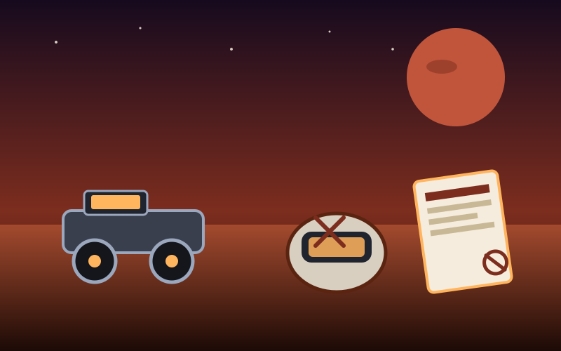
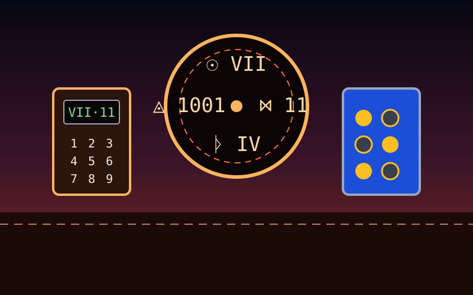
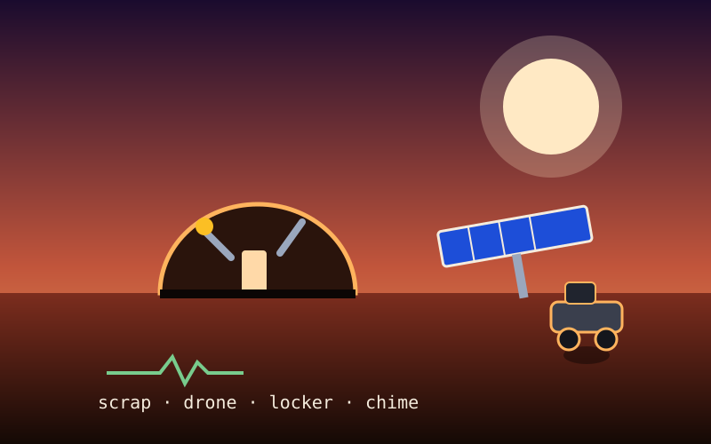
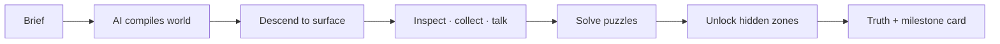

<div align="center">


# MYTHIO — forge any story into a playable world

[](https://github.com/xtharshh/apexus-trending)

-c1553b?style=for-the-badge)


-red?style=for-the-badge)
[](https://buymeacoffee.com/xtharshh)
[](https://instagram.com/xt.harshh)

> **MYTHIO** is a proprietary 3D mystery-game engine by **xtharshh**.
> Type a story brief — walk it as a living world: realistic hardware, correct
> per-object animations, voice narration, multiplayer explorers, checkpoints,
> leaderboards, and milestone brag cards.

[▶ Play the demo](#-run-it) · [✨ Features](#-what-it-does) · [🎮 Controls](#-controls) · [🤖 AI directors](#-ai-directors) · [☕ Support](#-support-mythio)



</div>

---

## ✨ What it does

| Pillar | Feel |
|---|---|
| 🌍 **Any story in** | Mars, ocean, forest, fantasy, horror, cyberpunk streets, metro stations — the engine dresses every object for its genre |
| 🤖 **Any AI director** | OpenAI · Anthropic · Gemini · OpenRouter · Groq · Mistral · NVIDIA NIM · Ollama · custom — or keyless Mock |
| 🧍 **Many solvers, one tale** | Live explorers in scenario suits, name tags, race rooms, per-tale leaderboard |
| 🎙️ **Voice everywhere** | TTS narration, mic commands, record-your-own story clips, voice notes on clues, audio self-test |
| 💾 **Never lose a run** | Per-explorer saves + named checkpoints (manual + auto) + quota-safe shelf that survives reloads |
| 🏆 **Show off** | 100% completion mints a shareable milestone card (X / WhatsApp / Telegram / …) |
| 🦸 **Your cast, your face** | Astronaut or chibi avatar body, 8 suits, hairstyles, gear, moods — plus `.glb` export |
| 📖 **Stories keep growing** | Continue Story chapters materialize as real 3D props and talking NPCs in the world |
| 🛣️ **Worlds arrive filled** | Every tale generates with connecting roads, lamps, and 300+ theme-dressed props — Mars rust, neon streets, deep forest, no empty stages |
| 📊 **Mission control** | Allowlisted `/admin` panel: live users online/offline, creations per explorer, API traffic by endpoint and country |

### 🕵️ A run looks like this

| Investigate the silence | Earn the ridge code | Rebuild to survive |
|---|---|---|
|  |  |  |
| Walk Aurora Base, inspect the rover, play the helmet recording, fill the clue journal. | Solar sequence, hunter glyphs, hatch keypad. The note and the song disagree — trust both. | Salvage metal and circuits, repair the habitat, restore the array, take the flight suit skyward. |

### 🗺️ How a run plays



Enter → clue → resource → puzzle → mission → hidden location → secret ending.

---

## 🎮 Controls

| Keys | Action |
|---|---|
| **W A S D** | Move (walk the terrain — feet follow dunes and avenues) |
| **Mouse drag** | Look around · **V** swaps 3rd / 1st person |
| **E / click** | Interact — inspect, collect, talk, repair |
| **Space** | Jump (**Space / C** ascend–descend while flying) |
| **F** | Flight suit thrusters (find the suit first) |
| **Shift** | Sprint |

Every action remaps to your own keys in the in-game **Control deck**. New explorers get a guided pointer tour on the home page with a live mouse-practice pad.

---

## 🤖 AI directors

| Provider | Key | Notes |
|---|---|---|
| Mock | none — keyless | Always available, deterministic Mars tale |
| OpenAI · OpenRouter · Groq · Mistral | site or own key | JSON mode, spare-key rotation on limits |
| NVIDIA NIM | site or own key | Served via the API relay (browsers can't call NVIDIA directly) |
| Anthropic · Gemini | own key | Native protocols, browser-safe |
| Ollama · Custom | endpoint | Local or any OpenAI-compatible gateway |

Every output is Zod-checked and repaired (conditions, enums, palettes, road/metro layouts) with one auto-retry that carries the validator's field report. Broken output never ships — Mock is the eternal fallback.

---

## 🚀 Run it

```bash
cd mythra
npm install
npm run dev        # game  → http://localhost:5173
npm run dev:api    # API   → http://localhost:4000  (multiplayer, leaderboard, cloud saves, NIM relay)
npm test           # 190+ vitest tests, all green
npm run build      # production build
```

Set `VITE_API_URL=http://localhost:4000` to light up multiplayer presence,
the shared leaderboard, and cloud saves. No key, no account needed to play.

<details>
<summary><b>🔐 Admin panel (optional)</b></summary>

```bash
# mythra/.env
ADMIN_EMAILS=you@example.com
ADMIN_KEY=change-me-to-something-long
```

Restart the API, open `/admin`, sign in — live users, creations per
explorer, and API traffic by endpoint and country. With either var unset,
every admin call fails closed.

</details>

<details>
<summary><b>🧱 Project structure</b></summary>

```
mythra/
├── src/pages/{Landing,Explore,Play,Create,Studio,Legal,Admin}  # Home · Stories · Play · Create · Studio · Admin
├── src/three/{LumenScene,HeroScene,AvatarMaker,factory,effects,worldPopulator}  # renderer + 70+ procedural models + smart world fill
├── src/game/* + src/ai/{providers,mockProvider}          # engines, conditions, 9 AI directors + prompt-smart Mock
├── src/components/*                                      # HUD, tutorial tour, avatars, voice, milestone, coffee
├── src/state/store + src/auth/auth + src/api/client      # saves, sessions, cloud sync
├── server/{index,db,discord,admin} + api/[...all]        # Fastify + SQLite, admin analytics, Vercel serverless
└── tests/unit/*.test.ts                                  # 36 suites
```

</details>

---

### ☕ Support MYTHIO

<div align="center">

<a href="https://buymeacoffee.com/xtharshh" target="_blank"></a>

**Every coffee keeps the suits charged** — new genres, new props, new worlds.

Your name lands in the mission log. The colony remembers. 🚀

[](https://instagram.com/xt.harshh)

</div>

### ⚖️ License — proprietary, all rights reserved

MYTHIO is **NOT open source**. See [`LICENSE`](./LICENSE): no use, copying,
distribution, or derivatives — and no ownership claims — without xtharshh's
written permission. Playing the hosted game is allowed; everything else needs
a yes in writing. 🎮 Build worlds. Give credit.
